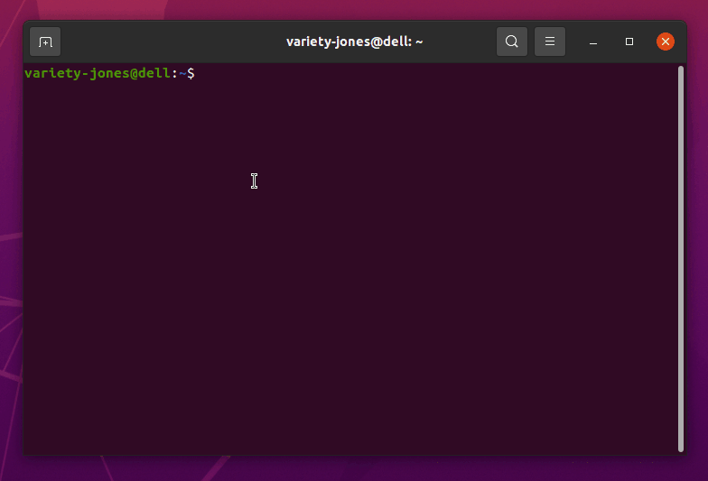

# Download
There's no installation or toolchain required.

# Linux
```
wget https://github.com/variety-jones/cfdoc/releases/download/v1.0.0/cfdoc-linux -O cfdoc
chmod +x ./cfdoc
sudo mv cfdoc /usr/bin
which cfdoc
```

# MacOS
```
wget https://github.com/variety-jones/cfdoc/releases/download/v1.0.0/cfdoc-osx -O cfdoc
chmod +x ./cfdoc
sudo mv cfdoc /usr/bin
which cfdoc
```

# Windows
Download [cfdoc.exe](https://github.com/variety-jones/cfdoc/releases/download/v1.0.0/cfdoc.exe) and add it to your PATH.

Here's a [reference](https://zwbetz.com/how-to-add-a-binary-to-your-path-on-macos-linux-windows/) on how to do that.

# Usage
```
cfdoc help
```